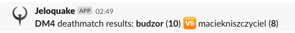

Quake-slack
---
Publish Q1 deathmatch results to Slack

### Usage
  - Edit your channel & bot data in `index.js`
  - Add Quake icon to [Slack custom emojis](https://get.slack.help/hc/en-us/articles/206870177-Add-custom-emoji)
  - Add the following to your crontab:
  ```
  * /5 * * * node index.js <slack-api-key> <ktx/mdv "demos" directory>
  ```
  - Enjoy


